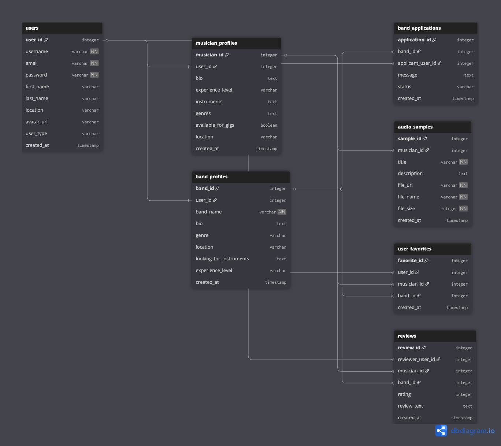

# Beat It! Backend API

A RESTful API for a music networking platform built with NestJS, TypeScript, and PostgreSQL. Beat It! connects musicians and bands, helping them showcase talent, find collaborators, and grow the music community.

🎵 **[Live API](https://beat-it-be.onrender.com/)** *(Coming Soon)*

## Features

- JWT-based user authentication  
- Musician and band profiles  
- Advanced search filters (location, genre, instruments, etc.)  
- Application system for musicians to join bands  
- File uploads (avatars and audio samples)  
- Full CRUD operations  
- Global error handling  
- E2E test coverage > 95%  

## Tech Stack

- **Backend**: NestJS, TypeScript  
- **Database**: PostgreSQL, TypeORM  
- **Auth**: JWT, bcryptjs  
- **Uploads**: Multer (local)  
- **Validation**: class-validator, DTOs  
- **Testing**: Jest  
- **Docs**: OpenAPI/Swagger  
- **Deployment**: Railway/Render (Docker-ready)

## API Endpoints

### Authentication

| Method | Endpoint           | Description             |
|--------|--------------------|-------------------------|
| POST   | `/api/auth/signup` | Register a new user     |
| POST   | `/api/auth/login`  | Login and get JWT token |

### Musicians

| Method | Endpoint               | Description                          |
|--------|------------------------|--------------------------------------|
| GET    | `/api/musicians`       | Fetch all musicians (with filters)   |
| GET    | `/api/musicians/:id`   | Get specific musician profile        |
| POST   | `/api/musicians`       | Create profile (auth required)       |
| PATCH  | `/api/musicians/:id`   | Update profile (auth required)       |
| DELETE | `/api/musicians/:id`   | Delete profile (auth required)       |

### Bands

| Method | Endpoint            | Description                          |
|--------|---------------------|--------------------------------------|
| GET    | `/api/bands`        | Fetch all bands (with filters)       |
| GET    | `/api/bands/:id`    | Get specific band profile            |
| POST   | `/api/bands`        | Create band (auth required)          |
| PATCH  | `/api/bands/:id`    | Update band (auth required)          |
| DELETE | `/api/bands/:id`    | Delete band (auth required)          |

### Applications

| Method | Endpoint                                | Description                                |
|--------|-----------------------------------------|--------------------------------------------|
| POST   | `/api/bands/:id/applications`           | Apply to band (auth required)              |
| GET    | `/api/bands/:id/applications`           | View applications (band owner only)        |
| PATCH  | `/api/applications/:id`                 | Accept/reject application (band owner)     |

### File Uploads

| Method | Endpoint                                 | Description                          |
|--------|------------------------------------------|--------------------------------------|
| POST   | `/api/musicians/:id/avatar`              | Upload avatar (auth required)        |
| POST   | `/api/musicians/:id/audio-samples`       | Upload audio (auth required)         |
| GET    | `/api/musicians/:id/audio-samples`       | Get audio samples                     |
| DELETE | `/api/audio-samples/:id`                 | Delete audio (auth required)         |

### Example Query Params

```http
GET /api/musicians?instrument=drums&genre=pop&location=Leeds
GET /api/bands?looking_for_instrument=bass&location=Bristol
```

## Getting Started

### Prerequisites

- Node.js v18+  
- PostgreSQL v14+  
- npm v8+  

### Installation

```bash
git clone https://github.com/yourusername/beat-it-backend.git
cd beat-it-backend
npm install
```

### Database Setup

```bash
npm run setup-dbs
```

Create two `.env` files:

**.env.development**
```ini
DB_HOST=localhost
DB_PORT=5432
DB_USERNAME=your_username
DB_PASSWORD=your_password
DB_NAME=beat_it
JWT_SECRET=your_jwt_secret
NODE_ENV=development
```

**.env.test**
```ini
DB_HOST=localhost
DB_PORT=5432
DB_USERNAME=your_username
DB_PASSWORD=your_password
DB_NAME=beat_it_test
JWT_SECRET=test_secret
NODE_ENV=test
```

> ⚠️ `.env` files are gitignored for security.

### Running the App

```bash
npm run start:dev     # Dev mode
npm run start:prod    # Prod mode
```

### Running Tests

```bash
npm test              # All E2E tests
npm run test:cov      # Coverage report
npm run test:watch    # Watch mode
```

## Database Schema

- - 

- **users**: Auth info  
- **musician_profiles**: Musician info, genres, instruments  
- **band_profiles**: Band info, looking-for list  
- **band_applications**: Musician-to-band applications  
- **audio_samples**: Uploaded music files

### Key Relationships

- 1:1 user ↔ profile(s)  
- 1:N band ↔ applications  
- 1:N musician ↔ audio samples

## Authentication

- Passwords hashed with bcryptjs  
- JWT valid for 24 hours  
- Protected routes require `Authorization: Bearer <token>`

## File Upload System

- **Images**: JPG, PNG (max 5MB)  
- **Audio**: MP3, WAV, FLAC (max 50MB)  
- Uses Multer for local storage  
- Cloud integration (e.g. S3) planned

## Error Handling

Standard error response:

```json
{
  "statusCode": 400,
  "timestamp": "2024-01-15T10:30:00.000Z",
  "path": "/api/musicians",
  "method": "POST",
  "message": ["email must be valid"]
}
```

## Future Roadmap

### Phase 1: User Experience
- Real-time chat (WebSocket)
- Push notifications
- Profile enhancements

### Phase 2: Community
- Reviews and ratings
- Follow system and feeds
- Gigs and event system

### Phase 3: Monetization & Mobile
- Stripe payments
- Premium features
- React Native app
- Live streaming

### Phase 4: AI & Analytics
- AI matching
- User insights dashboard
- Auto moderation

## API Documentation

- Local: `http://localhost:3000/api/docs`  
- Prod: `https://your-api-url.com/api/docs` *(Coming Soon)*

## License

MIT License. See [LICENSE](LICENSE).

## Support

- GitHub: [Create an issue](https://github.com/yourusername/beat-it-backend/issues)  
- Email: support@beatit-api.com  
- Docs: [Full API Docs](https://docs.beatit-api.com)

## Acknowledgments

- NestJS & TypeORM teams  
- Northcoders bootcamp  
- Open source community ❤️
